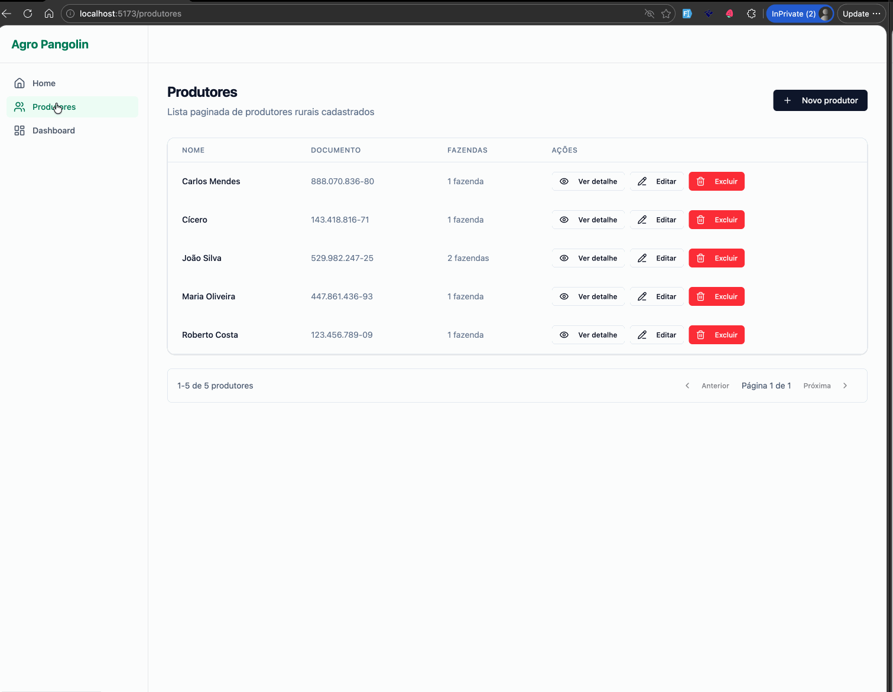

# AgroPangolin

Sistema web para gestão de produtores rurais, propriedades e atividades agrícolas no Brasil.

---

## Demonstração



---

## Sobre o projeto

O **AgroPangolin** permite cadastrar e gerenciar produtores rurais com suas fazendas, safras e culturas, além de oferecer um dashboard analítico com indicadores consolidados.

O nome é uma referência às escamas sobrepostas do pangolim — símbolo visual da **Arquitetura Hexagonal** adotada no backend, onde a lógica de negócio fica completamente isolada dos detalhes de infraestrutura.

---

## Funcionalidades

- **Gestão de produtores** — Cadastro, edição, visualização e exclusão de produtores rurais
- **Estrutura hierárquica** — Produtor → Fazendas → Safras → Culturas
- **Validações de negócio** — CPF/CNPJ válido; soma das áreas agrícola + vegetação não pode ultrapassar a área total
- **Dashboard analítico** — Total de fazendas, hectares, distribuição por estado, cultura e uso do solo
- **Interface responsiva** — Layout adaptado para desktop e mobile

---

## Stack

### Frontend

| Tecnologia | Uso |
|---|---|
| React 19 + TypeScript | Interface do usuário |
| Vite | Build e dev server |
| Redux Toolkit + RTK Query | Estado global e requisições |
| React Router 7 | Roteamento |
| Tailwind CSS v4 | Estilização |
| React Hook Form + Zod | Formulários e validação |
| Recharts | Gráficos do dashboard |
| Jest + MSW | Testes e mocks |

### Backend

| Tecnologia | Uso |
|---|---|
| NestJS 11 + TypeScript | Framework principal |
| Node.js 22+ | Runtime |
| PostgreSQL 15 + TypeORM | Banco de dados |
| Docker / Docker Compose | Containerização |
| Swagger / OpenAPI | Documentação da API |
| Jest | Testes unitários e E2E |

---

## Arquitetura

### Backend — Hexagonal (Ports & Adapters)

```
backend/src/
├── producers/        # Contexto transacional (CRUD)
│   ├── domain/       # Entidades, Value Objects, Ports, Policies
│   ├── application/  # Use Cases
│   └── infrastructure/ # Controllers, Repositories, DTOs, Mappers
├── dashboard/        # Contexto analítico (agregações)
└── health/           # Verificação de disponibilidade
```

### Frontend — Feature-based

```
frontend/src/
├── app/           # Store, router, providers
├── features/
│   ├── dashboard/ # Dashboard com gráficos
│   └── producers/ # CRUD de produtores
├── shared/        # Componentes, utilitários e API base
└── mocks/         # Handlers MSW e fixtures de teste
```

---

## Como rodar localmente

### Pré-requisitos

- Node.js 22+
- Yarn
- Docker e Docker Compose

### Backend

```bash
cd backend
cp .env.example .env
docker compose up -d   # Sobe o PostgreSQL
yarn install
yarn migration:run
yarn start:dev
```

A API ficará disponível em `http://localhost:3000`.
Documentação Swagger: `http://localhost:3000/api`.

### Frontend

```bash
cd frontend
yarn install
yarn dev
```

A interface ficará disponível em `http://localhost:5173`.

---

## Testes

### Frontend

```bash
cd frontend
yarn test
```

### Backend

```bash
cd backend
yarn test          # Testes unitários
yarn test:e2e      # Testes E2E (requer banco disponível)
```

---

## API — Principais endpoints

| Método | Endpoint | Descrição |
|---|---|---|
| `GET` | `/producers` | Lista produtores (paginado) |
| `POST` | `/producers` | Cria produtor |
| `GET` | `/producers/:id` | Detalha produtor |
| `PATCH` | `/producers/:id` | Atualiza produtor |
| `DELETE` | `/producers/:id` | Remove produtor |
| `GET` | `/dashboard` | Dados agregados do dashboard |
| `GET` | `/health` | Status da aplicação |

---

## Licença

Este projeto está sob a licença MIT.
