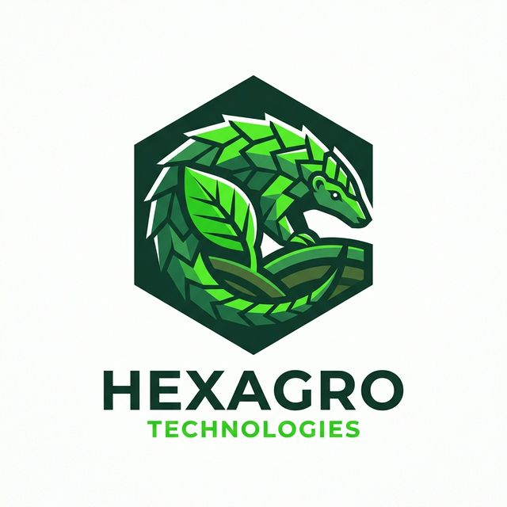
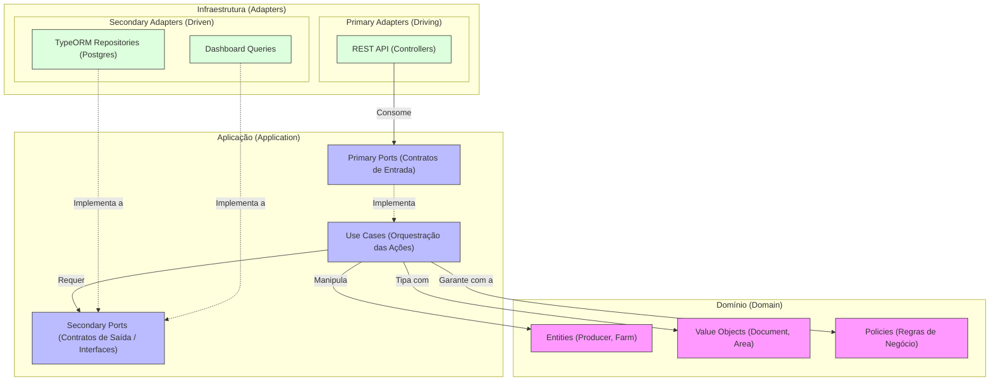

# Agro Pangolin

<div align="center">
  
</div>

> **Por que Agro Pangolin?**
> O pangolim é um animal coberto por escamas rígidas que se sobrepõem perfeitamente. No contexto do nosso sistema, essa armadura natural ilustra perfeitamente a essência da **Arquitetura Hexagonal** (Ports and Adapters). Assim como o pangolim se enrola protegendo seu núcleo vital, nossas portas e adaptadores blindam as regras de negócio de qualquer interferência tecnológica externa. Detalhes de infraestrutura, bancos de dados e APIs colidem na casca externa, permitindo que o "coração" agro do sistema pulse de maneira limpa, segura e totalmente isolada no centro da aplicação.

A aplicação foi construída para o gerenciamento de produtores rurais e visualização analítica (dashboard), utilizando Postgres, TypeORM, validações de borda, regras de domínio e health check.

## O Projeto

O Agro Pangolin é um sistema projetado para o cadastro de produtores rurais e suas propriedades, incorporando as seguintes regras de negócio garantidas pelo domínio da aplicação:
- Validação de CPF ou CNPJ.
- Garantia de que a soma da área agricultável e de vegetação não ultrapasse a área total da fazenda.
- Dashboard analítico integrado com totais de área, totais de fazenda e gráficos de distribuição.

## Arquitetura

O projeto adota a **Arquitetura Hexagonal** (Ports and Adapters), com fortes influências de Domain-Driven Design (DDD). O objetivo principal dessa escolha é **isolar completamente as regras de negócio** de detalhes de infraestrutura, como o framework (NestJS), o banco de dados (TypeORM/Postgres) e a camada de transporte (HTTP/REST). 

Dessa forma, a aplicação obedece à rigorosa regra de dependência: a infraestrutura depende da aplicação, que por sua vez depende unicamente do domínio.



### Detalhamento das Camadas Hexagonais
Abaixo, o aprofundamento de como as camadas de responsabilidade estão alocadas na base do código:

1. **Domain (O Núcleo)**: É agnóstico ao framework e à persistência. Contém os invariantes invioláveis. Protege a aplicação validando **Entity** (`Producer`, `Farm`), os **Value Objects** formativos e tipados (`Area`, `Document`) e aciona as **Policies** críticas para que nada inconsistente prossiga na transação (`FarmAreaConsistencyPolicy`).
2. **Application (As Portas e Casos de Uso)**: Fica recheada do comportamento real do sistema. Contém interfaces conhecidas como *Secondary Ports* (ex: `ProducerRepository`, `DashboardQuery`) para as quais a infraestrutura criará adapters. Também abrange os use-cases (ex.: `CreateProducerUseCase`), contendo as etapas lógicas orquestradas do produto (Recebe request na *Primary Port* → Converte para Domínio → Transaciona os Portáteis Secundários).
3. **Infrastructure (Os Adaptadores de Contorno)**: Última fronteira. Os *Primary Adapters* dirigem o início do ciclo, como os Controllers acoplados ao roteamento do próprio NestJS, filtragem DTO ou Swagger. Os *Secondary Adapters* fecham as portas para ferramentas externas, como os Data Mappers usando o TypeORM para persistir entidades nativamente no Postgres.

### Contextos Delimitados (Bounded Contexts)
A aplicação está dividida em contextos de negócio bem definidos:
- **`producers`**: Contexto transacional principal. Gerencia o cadastro, edição e exclusão de produtores, propriedades (Farms), safras (Harvests) e lida com as regras de consistência de áreas e validação de documentos usando objects no domínio.
- **`dashboard`**: Contexto analítico. Responsável por totalizações e consolidações de dados em tempo real, fornecendo informações gerenciais prontas para os gráficos de distribuição (por estado, cultura e uso do solo).
- **`health`**: Contexto operacional para verificação de disponibilidade da aplicação.

As responsabilidades das camadas, seguindo a topologia recomendada, são:
1. **Domain**: Entidades (`Producer`, `Farm`), Value Objects (`Area`, `Document`) e Policies (`FarmAreaConsistencyPolicy`). Protege os invariantes de negócio sem nenhum acoplamento com o framework NestJS.
2. **Application**: Casos de uso (ex.: `CreateProducerUseCase`) que coordenam o ciclo da ação e portas de leitura e escrita (ex.: `ProducerRepository`, `DashboardQuery`).
3. **Infrastructure**: Controllers HTTP, Repositórios TypeORM conectados ao banco Postgres, injeção de dependências do NestJS e documentação Swagger.

## Tecnologias Utilizadas

- **Backend**: Node.js, TypeScript e NestJS.
- **Banco de Dados**: PostgreSQL com TypeORM.
- **Testes**: Jest para testes Unitários (focados no domínio/casos de uso) e E2E.
- **Ambiente**: Docker Engine e Docker Compose.

## Pré-requisitos

- Node.js 22+
- Yarn 1.x
- Docker e Docker Compose (para orquestrar todos os contêineres e dependências facilmente)

## Variáveis de Ambiente

Para o ambiente local ou contêiner, garanta que suas variáveis de ambiente estejam exportadas corretamente. O projeto utiliza variáveis padrões de fácil injeção:

```bash
export DB_HOST=localhost
export DB_PORT=5432
export DB_USER=postgres
export DB_PASSWORD=postgres
export DB_NAME=agropangolin
export PORT=3000
```

## Execução via Docker (Recomendado)

Para subir o banco de dados e a aplicação simultaneamente de forma orquestrada, execute na raiz do projeto:

```bash
docker-compose up -d --build
```

O compose cuidará de aplicar dependências e iniciar a API. Caso precise rodar as migrations da sua estrutura de banco de dados ou rodar seeds simuladas manualmente:

```bash
docker exec -it agro-pangolin-api yarn migration:run
docker exec -it agro-pangolin-api yarn seed
```

## Execução Local

Caso deseje rodar o NestJS diretamente da sua máquina contra um banco Postgres local:

```bash
yarn install
yarn migration:run
yarn seed
yarn start:dev
```

## Documentação da API via Swagger

A aplicação possui validações de borda expostas via **Swagger UI** permitindo ver todos os endpoints e contratos de API de forma clara.

Com a aplicação rodando, acesse a documentação abaixo em seu navegador:
- **Swagger UI**: [http://localhost:3000/docs](http://localhost:3000/docs)
- **OpenAPI JSON**: [http://localhost:3000/docs-json](http://localhost:3000/docs-json)

## Endpoints Principais

### Health Check (Disponibilidade)
- `GET /health`

### Produtores Rurais (Contexto Producers)
- `POST /producers` - Realiza o cadastro de um produtor (e suas propriedades/culturas vinculadas)
- `GET /producers` - Lista os produtores (suporta paginação)
- `GET /producers/:id` - Busca detalhes de um produtor específico
- `PATCH /producers/:id` - Atualiza dados do produtor/propriedade
- `DELETE /producers/:id` - Remove o cadastro do produtor

### Dashboard Gerencial (Contexto Analytics)
- `GET /dashboard` - Retorna a leitura gerencial consolidada: 
  - Total de fazendas.
  - Total de hectares agricultáveis das fazendas cadastradas.
  - Divisão percentual em gráficos consolidadas por: **Uso de solo**, **Estados** e **Culturas**.

## Testes Automatizados

Garantia de que as regras foram supridas através de uma densa malha de testes, separados em unidade e teste ponto-a-ponto (End-To-End), incluindo a validação de regras de domínio, limites das áreas agricultáveis, consistência dos validadores e persistência correta de safras e dados:

```bash
# Executa a suíte de testes unitários (Mocks, Regras de negócio)
yarn test

# Executa a suíte de testes E2E/Integrados (Testa fluxo real em DB de Teste Isolado)
yarn test:e2e
```
